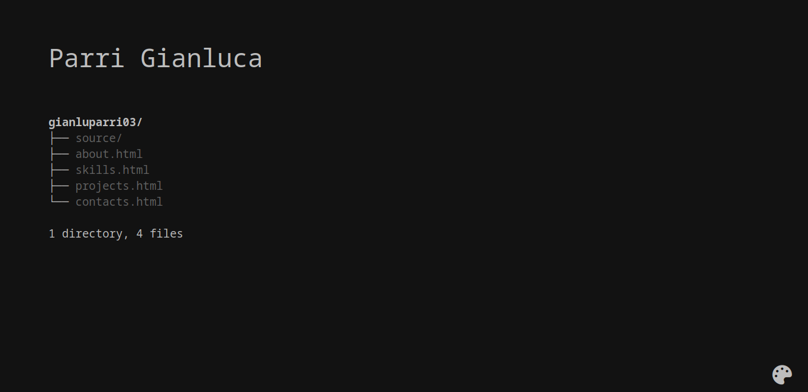

# gianluparri03.github.io

This is the repo for my portfolio, available at [gianluparri03.github.io](https://gianluparri03.github.io).

## Pages

Each page is, or is going to be, an output of a bash command or is written in a specific syntax. Here's the list:

* **index.html:** `tree`
* **about.html:** `vim`
* **skills.html** `diff` (with `-y` in horizontal screens)
* **projects.html:** _ehm_
* **contacts.html:** a `json` file

## Color Schemes

Currently it supports 5 color schemes:

|  **Name**  | **Background** |  **Text** |  **Link** |
|:----------:|:--------------:|:---------:|:---------:|
|  **Dark**  |    `#121212`   | `#BDBDBD` | `#616161` |
|  **Light** |    `#EEEEEE`   | `#000000` | `#757575` |
|  **Ocean** |    `#E3F2FD`   | `#01579B` | `#03A9F4` |
| **Nature** |    `#E8F5E9`   | `#2E7D32` | `#4CAF50` |
|  **Pony**  |    `#FCE4EC`   | `#AD1457` | `#E91E63` |

If you want to add another one, just add an element to `schemes` (in [color_schemes.js](color_schemes.js)).

## Credits

The icon used to change color scheme is taken from [Font Awesome](https://fontawesome.com).
